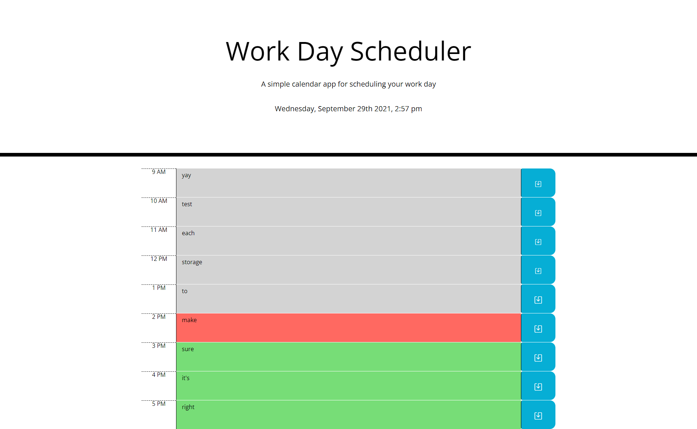
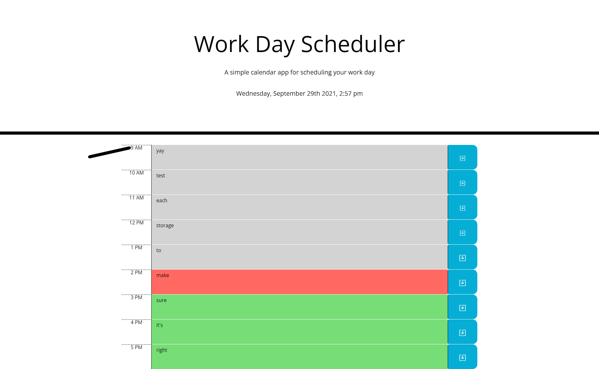
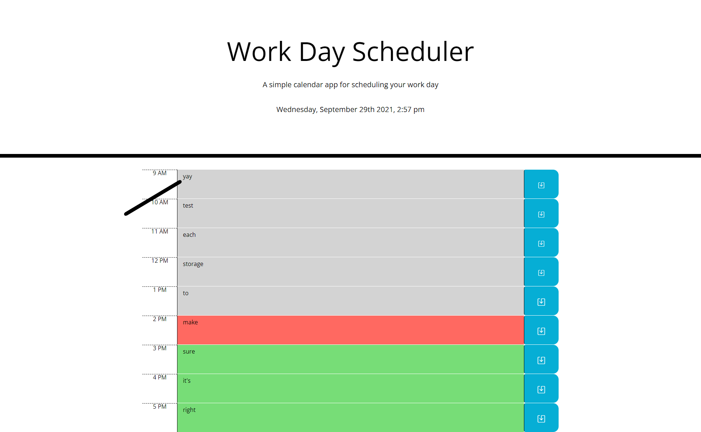
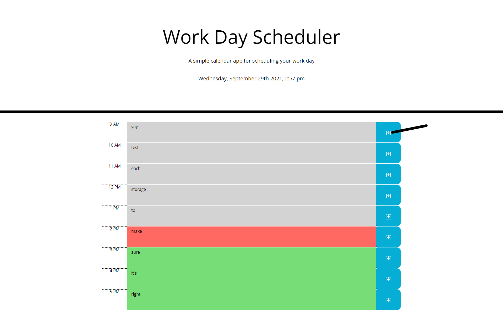

# Homework-5-Calendar-App

## Description
This is a simple web calendar app that keeps track of the current day's business hours events.<br/><br/> 
<br/><br/> 

In the actual time blocks themselves, it is split up into 3 columns.
The left most column is the column with a time label for the row.<br/><br/> 
<br/><br/> 

The middle of the row, takes up the most area of the actual row and has the events where the user typed for the hour.<br/><br/> 
<br/><br/> 

And the right most element is a save button that saves the text in the middle area and keeps it there, even on refresh page, until another event is saved.<br/><br/> 
<br/><br/> 

The scheduler also keeps track of the current, past, and future hours of the day. It updates all of the hours by color with red signifying the current hour,
green for future hours, and grey for past hours.<br/><br/> 
<br/><br/>

## Languages Used
The app was written in Javascript/HTML/CSS and involves the use of web APIs, such as jQuery, as well as third party APIs, such as moment.js and bootstrap. The layout of the page
involves the use of bootstrap's column and row classes built in. <br/><br/>

Bootstrap 4.5: [Bootstrap 4.5](https://getbootstrap.com/docs/4.5/getting-started/introduction/)<br/><br/>
jQuery: [jQuery Core 3.6.0](https://code.jquery.com/)<br/><br/>
Moment.js: [moment.js](https://momentjs.com/)

## User Story
```md
AS AN employee with a busy schedule
I WANT to add important events to a daily planner
SO THAT I can manage my time effectively
```
